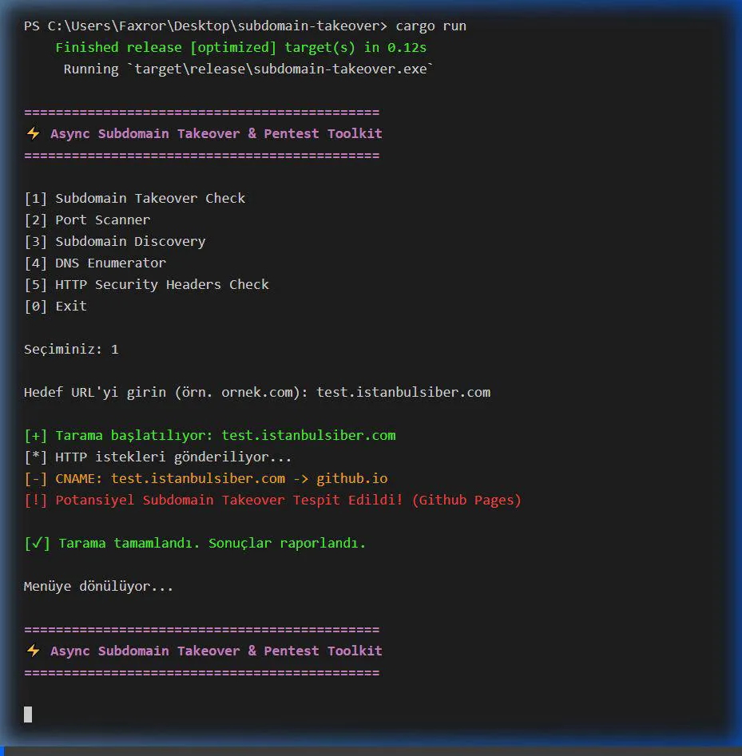

<div align="center">
  
  
  # ⚡ Async Subdomain Takeover & Pentest Toolkit

  [](https://github.com/denizpekova/subdomain-takeover/actions)
  [](https://www.rust-lang.org/)
  [](LICENSE)
</div>

Bu proje, Rust tabanlı, yüksek performanslı ve asenkron (`Tokio` altyapısı) çalışan kapsamlı bir ofansif güvenlik (pentest) aracıdır. Zafiyet taraması, port açıklarının tespiti ve DNS/Subdomain bilgi toplamayı tek bir etkileşimli menü üzerinden saniyeler içinde yapmanızı sağlar.

---

**Öğrenci:** Deniz Pekova  
**Danışman Akademisyen:** Keyvan Arasteh
**Kurum:** İstinye Üniversitesi, Bilişim Güvenliği Teknolojisi

---

## 📋 İçindekiler (Table of Contents)
- [🌟 Ana Özellikler](#-ana-özellikler)
- [🛠️ Teknolojiler Yığını (Tech Stack)](#️-teknolojiler-yığını-tech-stack)
- [⚙️ Kurulum ve Kullanım](#️-kurulum-ve-kullanım)
  - [Docker ile Kullanım](#docker-ile-kullanım)
- [⚠️ Sorumluluk Reddi (Disclaimer)](#️-sorumluluk-reddi-disclaimer)
- [📜 Lisans](#-lisans)

---

## 🌟 Ana Özellikler

### 1. 🚩 Subdomain Takeover Kontrolü
* Hedef domain veya subdomain'e HTTP isteği atarak potansiyel zaafiyetleri inceler.
* Arkasında sahipsiz bırakılmış **CNAME** kayıtlarını ve üçüncü taraf bulut servislerini popüler "NXDOMAIN" parmak izi okuması ile saptar (örn. *GitHub Pages, Amazon S3, Heroku*).

### 2. 🚀 Asenkron Port Tarayıcı
* `1`'den `65535`'e kadar tüm TCP portlarını 500 paralel soketle (semaphore limitli) eşzamanlı tarar.
* Servisleri test ederken düşük gecikme ayarlarına (timeout) sahiptir.

### 3. 🔍 Subdomain Keşfi (Wordlist & Brute-Force)
* İstek yollayarak wordlist tabanlı alt alan adı tespiti yapar.
* **Akıllı İndirme:** Araca talimat verip saniyeler içinde **SecLists'in** 5000 kelimelik top listesini doğrudan çekip asenkron test edebilirsiniz.

### 4. 📡 DNS Kayıt Keşfi (Record Enumerator)
* Modern `hickory-resolver` kullanılarak **A, AAAA, MX, NS, TXT** DNS kayıtları sorgulanır.

### 5. 🛡️ HTTP Güvenlik Başlıkları Kontrolü
* Uygulamaların `Strict-Transport-Security`, `CSP` vb. politikalarını tarar.
* Sızan `Server` başlıklarını uyarır.

---

## 🛠️ Teknolojiler Yığını (Tech Stack)

* **[Rust](https://www.rust-lang.org/):** Güvenli ve ışık hızında derlemeli dil.
* **[Tokio](https://tokio.rs/):** Yüksek seviye IO ve asenkron işlemler.
* **[Hickory DNS](https://hickory-dns.org/):** Modern asenkron DNS çözümleyici.
* **[Reqwest](https://docs.rs/reqwest/latest/reqwest/):** Asenkron HTTP istemcisi.
* **[Docker](https://www.docker.com/):** İzolasyon ve taşınabilir kurulum. (Opsiyonel)

---

## ⚙️ Kurulum ve Kullanım

### Bağımlılıklar
- [Cargo ve Rust Toolchain](https://rustup.rs/) (Manuel kurulum için)

### Doğrudan Kurulum

1. Depoyu klonlayın:
   ```bash
   git clone https://github.com/denizpekova/subdomain-takeover.git
   cd subdomain-takeover
   ```

2. `.env` yapılandırmasını kopyalayın (isteğe bağlı):
   ```bash
   cp .env.example .env
   ```

3. Derleyip çalıştırın:
   ```bash
   cargo run
   ```

### Docker ile Kullanım

Projeyi kendi ortamınızı kirletmeden container içinde derleyip çalıştırabilirsiniz:

```bash
docker build -t subdomain-takeover .
docker run -it --rm subdomain-takeover
```

---

## ⚠️ Sorumluluk Reddi (Disclaimer)
Bu araç yalnızca **bilgi güvenliği çalışmaları** ve **siber güvenlik uzmanlarının araştırmaları** amacıyla tasarlanmıştır. Başka sistemlerin üzerine yazılı test izni almadan çalıştırılması yasa dışıdır.

## 📜 Lisans
Bu proje **MIT Lisansı** altında lisanslanmıştır. Detaylar için [LICENSE](LICENSE) dosyasına bakınız.

---

## 🎬 Demo

Projenin asenkron çalışma hızını ve özelliklerini gösteren terminal kayıtları aşağıdadır:

<div align="center">
  
</div>

